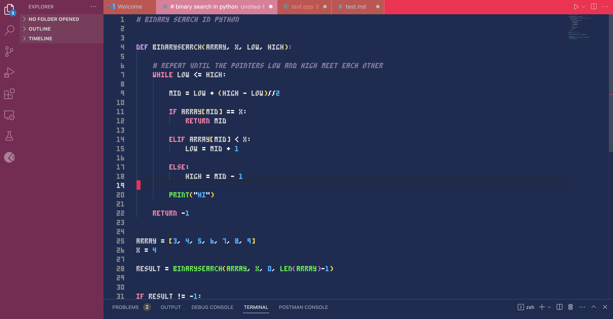
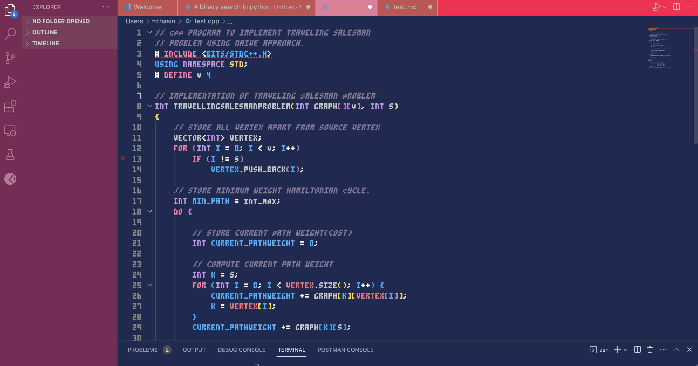
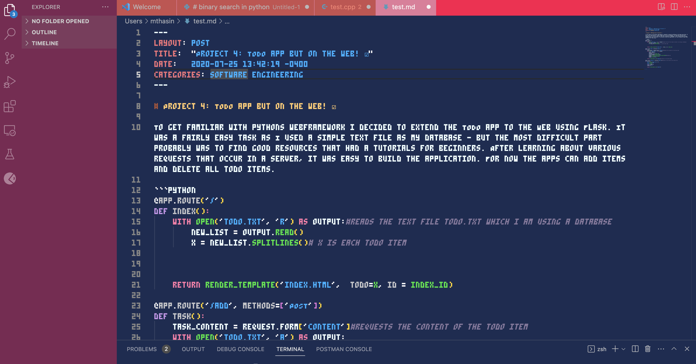
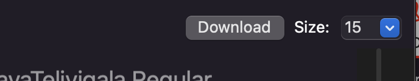

# PICO-8-theme 
</br>

This is a Vscode theme inspired by pico-8 text editor. 
</br>

### Python


</br>

### C++


</br>

### Markdown


</br>

### Selection


</br>

## Installation

1. Open the **Extensions** sidebar panel in VS Code. `View → Extensions`

2. Search for `Pico-8-theme`

3. Click `Install`

4. When prompted, select `Pico-8-theme` as the color theme

> In case of not being prompted to select a Color Theme upon installing, go to the menu bar and select: `Code (File, on Windows) > Preferences > Color Theme > Pico-8-theme`. Alternatively, you can use the shortcut `⌘/Ctrl + K > ⌘/Ctrl + T` and select `Pico-8-theme`.

<br />

## Typography and cursor 

I am using the pico-8 font from https://fontstruct.com/fontstructions/show/2052852/pico-8-27 , and I  have my own personal settings for the cursor. To change the font and the cursor settings:

1. Download the font and install the font to your computer
    (MAC USERS): after unzipping the file -> click the '.tff' file and click download 

    


2. Open Vscode and then go to the command palette and type "Preferences: Open User Settings (JSON)", Edit your user settings to include

```
{
    "[python]": {
        "editor.formatOnType": true
    },
    "solidity.telemetry": false,
    "window.zoomLevel": 1,
    "workbench.colorCustomizations": {
    "editorCursor.foreground": "#FF004D" ,// Pink color for the cursor,
    "editorCursor.background": "#ca597b"  
  },
  "editor.fontSize": 14,
  "editor.cursorWidth": 20,
  "editor.fontWeight": "normal",
  "editor.fontLigatures": true,
  "editor.fontFamily": "PICO-8",
}
``` 


</br>

### Contributions

Any issues, feedback and contributions are welcome! Please make an issue in the Repo's issues [Repo's GitHub Issues](https://github.com/maishathasin/vscode-pico8/issues) page, provide feedback or request a feature by submitting a issue or a PR.

<br/>


**Enjoy!**
